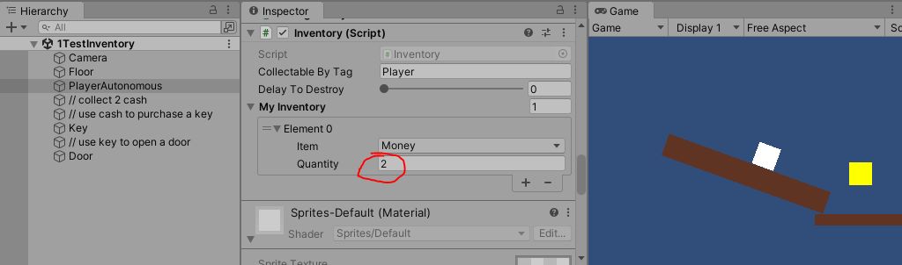

# What it is

Inventory framework for item collection and triggering audio based on what the character is holding in their inventory.

Developed to help make platformer games with art and audio from children. My children contributed to the art shown in https://github.com/Feddas/Rapunzel.

# How to use Inventory.cs

The object that can collect items should have the following:
1. Rigidbody 2D
2. Box Collider 2D
3. Be Tagged, in the example below the white cube is tagged as "Player".
4. Inventory.cs

All collectable items need:
1. A Box Collider 2D with Is Trigger checked
2. Inventory.cs with at least 1 item in MyInventory.

An example of Inventory.cs being used to collect coins is shown in TestInventory.unity. You'll see the white squares' cache of money go up as it slides down the ramp.

# Inventory architecture

Events are fired depending on how inventory matches during a collision.

List of Event types:
- play audio
- SetActive of gameobject to false
- LoadScene
- Tranlate object to match another objects position

### How Inventory Works
Each item, item holder, or object that can be interacted with an item have their own inventory. A component called Inventory.cs
Each item in the inventory has a number.
positive numbers mean collided gets that item.
negative numbers mean collided requires that item.

### How collectables work
The object that can collect the item needs an Inventory.cs and to be Tagged.
The collectable uses that tag, in the Inventory.cs component, to determine if the item can be collected.
The collectables MyInventory determines what will be added to the object that can collect when they collide.

### How Inventory interaction works
Every object that can be interacted with has both an Inventory.cs and an InventoryEvent.cs
InventoryEvent.cs's variable EventByInventoryMatch contains a list of events and their associated item requirements.
If another object with a Inventory.cs colliding with this object matches that requirement, a UnityEvent is fired.
InventoryEvent.cs routes that event to a manager, referenced by its ActionManager variable, that contains an InventoryAction.cs component.
If on collision there are matches for multiple events, the one which has the most matching inventory items is fired.
InventoryEvent is run before inventory script allowing unmodified values to be used.

# Repositories

Before packaging: https://github.com/Feddas/Rapunzel
