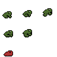
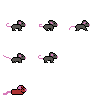
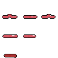
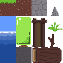

# Goals

1. PixelArt game collab with a 13 and 10 year old.
2. Playable on touch screens, keyboard, and standard game controllers.

# Play

Playable in web browser at https://Veaizy.github.io/PixelArtVelizo/ .

# Art

## Playable characters
1. Frog  - the only character that can jump.
1. Mouse 
1. Worm  - can go inside logs

## Enviroments

1. Forest 

# Edu

## Systems used in this project:

Tilemap
- setup https://youtu.be/otQH2M-Lkd0
- fix tearing between tiles https://youtu.be/pXc-H0pb668
- Gameobject brushes allow a [tilemap to have collectable items](https://stackoverflow.com/questions/50879984). Velizo uses them for doors. To add a door:
  1. Open Window/TilePalette
  2. Choose the "Forest" palette
  3. In the lower left beneath the tiles of the palette you'll see "Default Brush". Click it to change it "Gameobject Brush". "Gameobject Brush" is another layer of brushes available to pain with.
  4. In Velizo, only the "Bottom door" is setup to be a "Gameobject Brush" by linking to the TileBrushDoor.prefab. So click on the Bottom door.
  5. Switch to the Active Tilemap layer you want the door to be in. "Background" is suggested so the player can be seen ontop of the door.
  6. Paint some door!
  7. In the Tile Palette, switch "Gameobject Brush" back to "Default Brush". If you don't do this, all the other tiles will always paint as empty tiles since they're not linked to any prefabs.
  8. In the heirachy of the scene (or prefab containing the painted tiles), find the doors and set them up to be individualized. For example, drag in the particular scene they should load when they're touched.

Input
- basic setup https://youtu.be/xrLlZ1mHCTA 
- indepth understanding https://gamedevbeginner.com/input-in-unity-made-easy-complete-guide-to-the-new-system/#player_input_component
- setup for keyUp and keyDown https://forum.unity.com/threads/solved-creating-a-similar-input-to-input-getkeydown.863356/#post-5688229

Animate
- sprite sheet animations Brackeys: https://youtu.be/whzomFgjT50 Velvary: https://youtu.be/0cycus0Ojnc

Follow camera with cineamachine https://youtu.be/2KWHMSCxibA
## Systems that could be good for this project

Pixelate rotations with https://docs.unity.cn/Packages/com.unity.2d.pixel-perfect@5.0/manual/index.html

CICD https://youtu.be/JjKCy3H0A30 / https://github.com/rohanmayya/UnityCICD-Youtube / https://game.ci/docs/github/activation/

# Repo

1. GitHub: https://github.com/Veaizy/PixelArtVelizo
